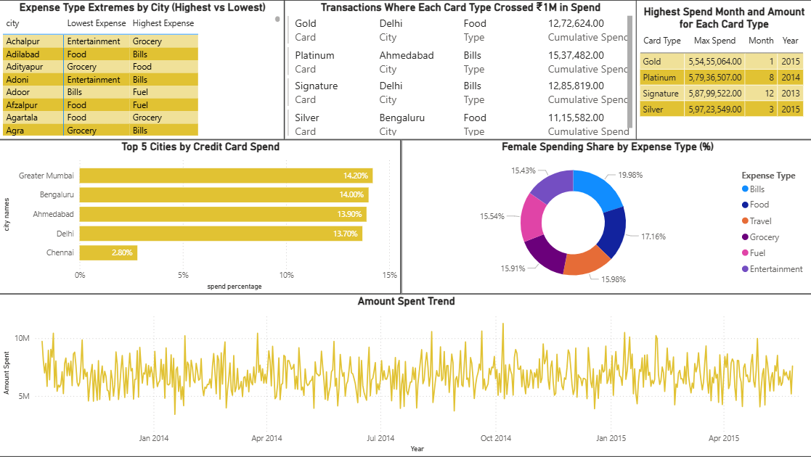

# Credit Card Spend Analysis

A complete portfolio project analyzing Indian credit card transactions using SQL Server and Power BI.

## Project Overview
- Dataset: [Kaggle – Credit Card Transactions in India](https://www.kaggle.com/datasets/thedevastator/analyzing-credit-card-spending-habits-in-india)
- Tools: SQL Server (T-SQL), Power BI
- Goal: Derive insights on consumer spending behavior across cities, card types, and expense types

## Key Insights
- Top 5 cities by total spend and % contribution
- Monthly peak spend by card type
- Cumulative ₹1M spend detection by card
- Gender-wise and expense-type insights
- Spending behavior over time

## 📊 Dashboard Preview

## 🧠 Skills Demonstrated
- Writing complex analytical SQL queries
- Data cleaning and import optimization in SQL Server
- Interactive dashboard design in Power BI
- Visual storytelling and layout aesthetics

---
